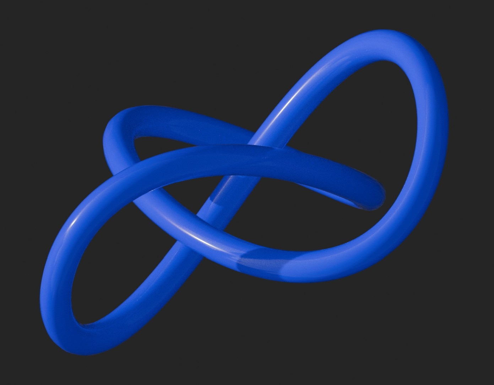
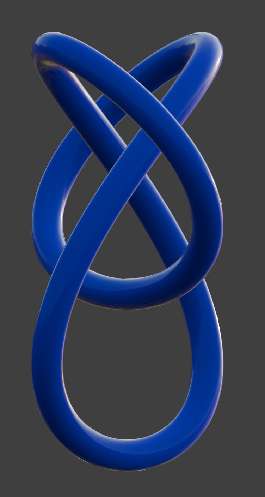
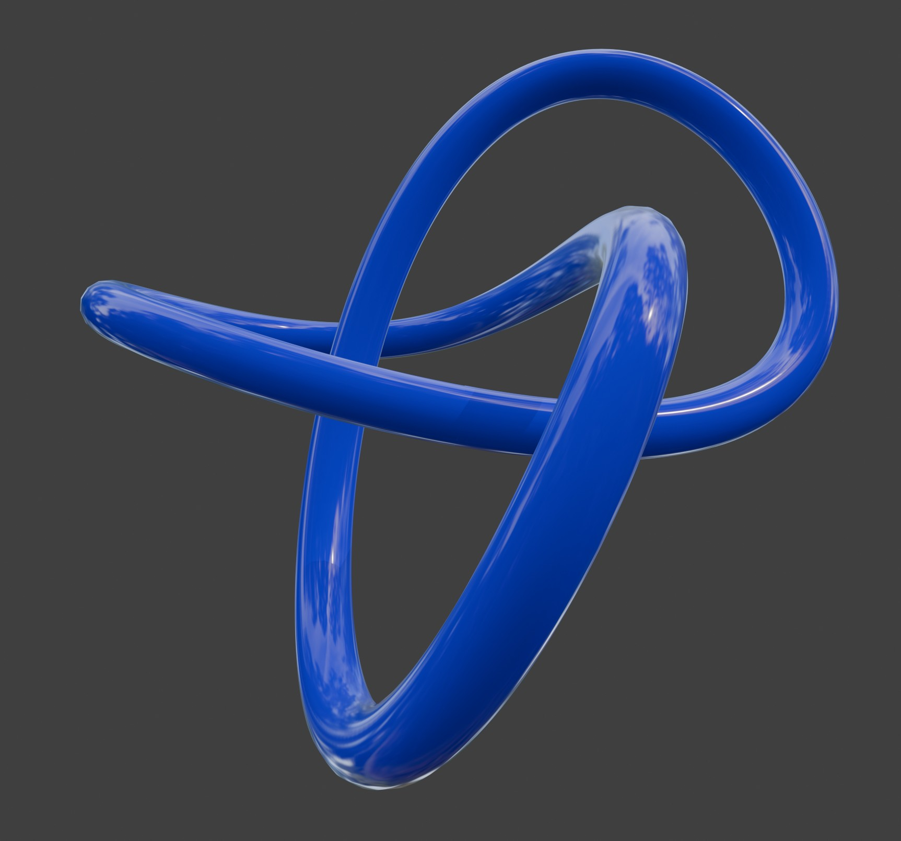
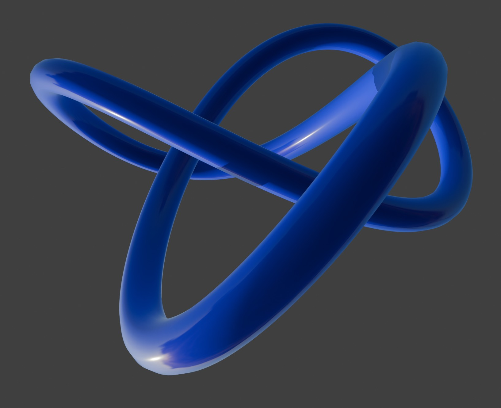
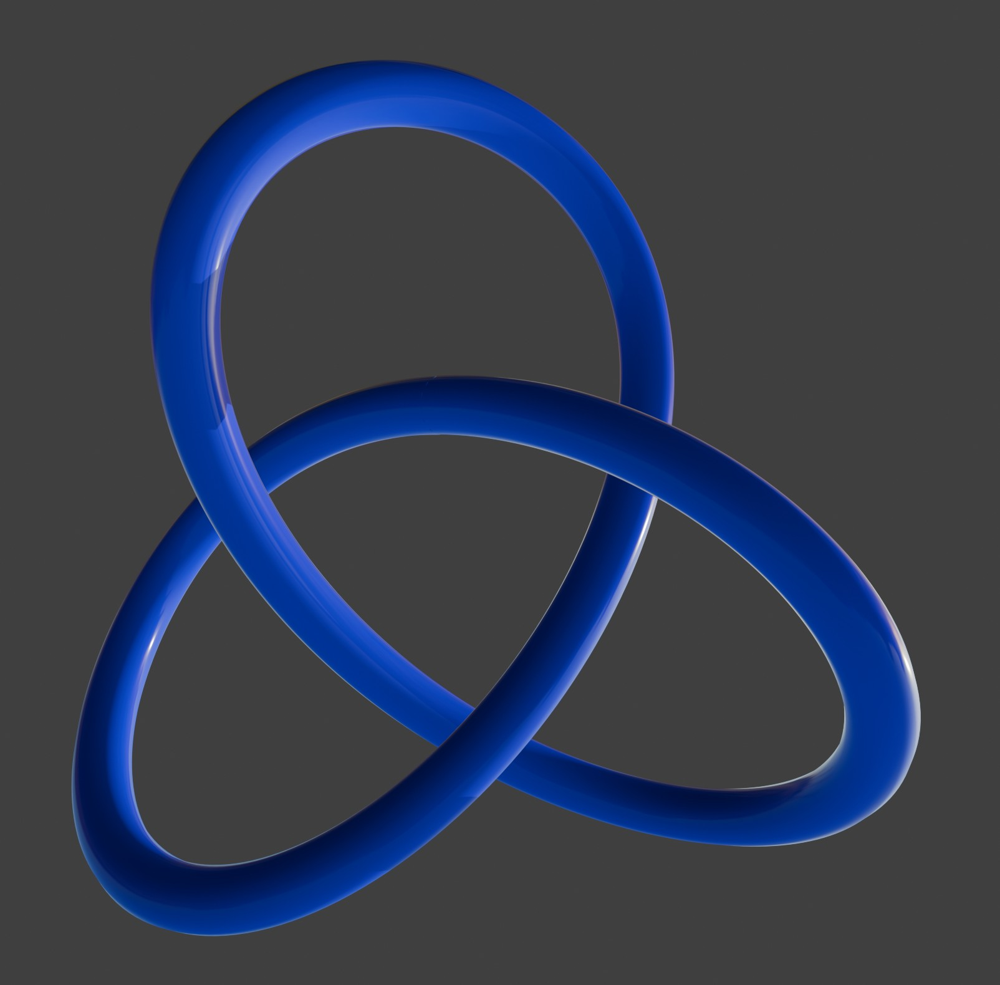
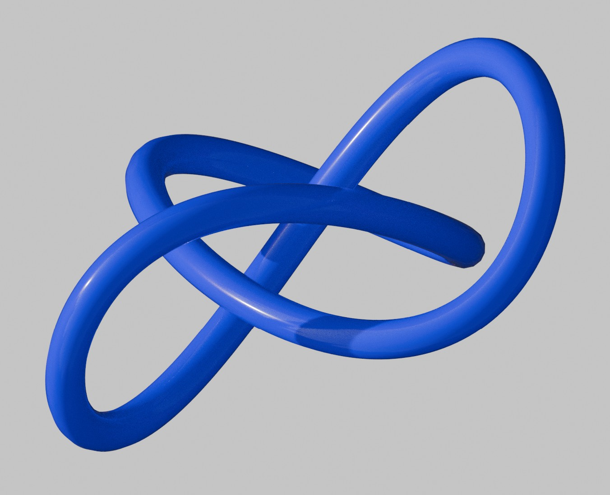
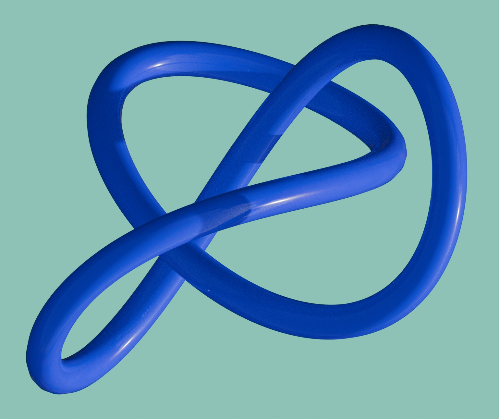

# Directory `images/Graphics3D/TreFoilKnotRayTracing`

This directory contains JPEG images of trefoil knots rendered with ray tracing. Models of knots were generated by IGLib.Grapgics3D and exported to a file, then imported and rendered by the [Blender](https://en.wikipedia.org/wiki/Blender_(software)). See also the **[images/ directory readme](../../README_images_info.md)**.

## Images Contained in this Directory

---

[TrefoilKnot_Blue_RayTracer_BlackBackground.jpg](./TrefoilKnot_Blue_RayTracer_BlackBackground.jpg):

<a href="./TrefoilKnot_Blue_RayTracer_BlackBackground.jpg">
  </img>
</a>

---

[TrefoilKnot_Blue_RayTracer_BlackBackground_AlignedSideways.jpg](./TrefoilKnot_Blue_RayTracer_BlackBackground_AlignedSideways.jpg):

<a href="./TrefoilKnot_Blue_RayTracer_BlackBackground_AlignedSideways.jpg">
  </img>
</a>

---

[TrefoilKnot_Blue_RayTracer_BlackBackground_ForestReflections.jpg](./TrefoilKnot_Blue_RayTracer_BlackBackground_ForestReflections.jpg):

<a href="./TrefoilKnot_Blue_RayTracer_BlackBackground_ForestReflections.jpg">
  </img>
</a>

---

[TrefoilKnot_Blue_RayTracer_BlackBackground_MetallicBSDF.jpg](./TrefoilKnot_Blue_RayTracer_BlackBackground_MetallicBSDF.jpg):

<a href="./TrefoilKnot_Blue_RayTracer_BlackBackground_MetallicBSDF.jpg">
  </img>
</a>

---

[TrefoilKnot_Blue_RayTracer_BlackBackground_NearlyAligned.jpg](./TrefoilKnot_Blue_RayTracer_BlackBackground_NearlyAligned.jpg):

<a href="./TrefoilKnot_Blue_RayTracer_BlackBackground_NearlyAligned.jpg">
  </img>
</a>

---

[TrefoilKnot_Blue_RayTracer_GrayBackground.jpg](./TrefoilKnot_Blue_RayTracer_GrayBackground.jpg):

<a href="./TrefoilKnot_Blue_RayTracer_GrayBackground.jpg">
  </img>
</a>

---

[TrefoilKnot_Blue_RayTracer_GrayBackground_1.jpg](./TrefoilKnot_Blue_RayTracer_GrayBackground_1.jpg):

<a href="./TrefoilKnot_Blue_RayTracer_GrayBackground_1.jpg">
  </img>
</a>

---

[./TrefoilKnot_Blue_RayTracer_GreenBackground_1.jpg](./TrefoilKnot_Blue_RayTracer_GreenBackground_1.jpg):

<a href="./TrefoilKnot_Blue_RayTracer_GreenBackground_1.jpg">
  </img>
</a>

---
