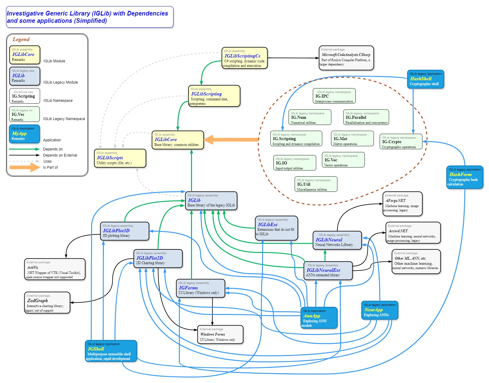

# Directory `images/IGLib`

This is directory `images/IGLib/` in the [IGLib Framework's web site](../../index.html) ([site on GitHub](https://ajgorhoe.github.io/IGLibFramework/); [images/IGLib/ directory on GitHub](https://ajgorhoe.github.io/IGLibFramework/images/IGLib/README_images_IGLib.md))

## Images Contained in this Directory

---

[IGLibDependencyGraph.svg](./IGLibDependencyGraph.svg):

<a href="./IGLibDependencyGraph.svg">
  </img>
</a>

---

[IGLibDependencyGraph.jpg](./IGLibDependencyGraph.jpg):

<a href="./IGLibDependencyGraph.jpg">
  </img>
</a>

---

